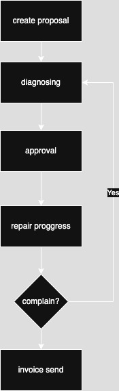

<p align="center"><a href="https://laravel.com" target="_blank"></a></p>
<h1 align="center">Car Workshop System</h1>

# HOW TO RUN

## install depedencies

before running the app make sure you install the required depedencies by running the following command

_note: make sure composer is installed on your machine_
[install composer](https://getcomposer.org/doc/00-intro.md)

```sh
composer install
```

## run migration

```sh
php artisan migrate
```

## running localy

```sh
php artisan serve
```

## running on docker compose

using laravel sail command

```sh
./vendor/bin/sail up -d
```

or using docker compose command

```sh
docker compose up -d
```

# Documentation

## Entity Relationship Diagram (ERD)

https://dbdiagram.io/d/car-workshop-system-67f95c5a4f7afba184493117

## State Machine Diagram



## Postman Collection
https://www.postman.com/red-space-400771/workspace/car-workshop-system/collection/23469470-57d8de5e-ba9d-4669-b752-5b75e7db80a6?action=share&creator=23469470&active-environment=23469470-29664b89-5820-4cc2-b06a-6282dfe37d62
